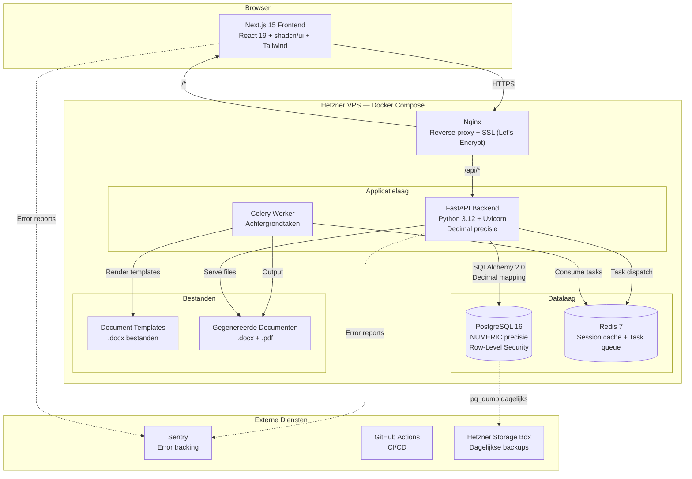

# DECISIONS.md — Luxis Tech Stack

> **Datum:** 17 februari 2026
> **Auteur:** Claude Code (Opus 4.6) in opdracht van Arsalan
> **Status:** Definitief — goedgekeurd door Arsalan

---

## 1. Gekozen Stack

| Laag | Keuze | Versie | Kosten |
|------|-------|--------|--------|
| Backend framework | FastAPI | Python 3.12, FastAPI 0.115+ | Gratis |
| Database | PostgreSQL | 16.x | Gratis (self-hosted) |
| ORM + Migraties | SQLAlchemy + Alembic | SQLAlchemy 2.0, Alembic 1.13+ | Gratis |
| Frontend framework | Next.js (App Router) | 15.x, React 19 | Gratis |
| UI componenten | shadcn/ui + Tailwind CSS | Tailwind 3.4+ | Gratis |
| Documentgeneratie | docxtpl + WeasyPrint | docxtpl 0.18+, WeasyPrint 62+ | Gratis |
| Authenticatie | Custom JWT | python-jose 3.3+, passlib 1.7+ | Gratis |
| Error tracking | Sentry | SaaS (Developer plan) | ~€26/mnd |
| Deployment | Docker Compose | Docker 25+, Compose 2.24+ | Gratis |
| Hosting | Hetzner VPS (CX33) | 4 vCPU, 8GB RAM, 80GB NVMe | ~€5,49/mnd |
| Backup | Hetzner Storage Box | 100GB | ~€3/mnd |
| CI/CD | GitHub Actions | — | Gratis (private repo) |
| Task queue | Celery + Redis | Celery 5.4+, Redis 7+ | Gratis |
| Reverse proxy + SSL | Nginx + Let's Encrypt | Nginx 1.25+, Certbot | Gratis |
| Python tooling | uv (package manager), ruff (linter), mypy (type checker) | — | Gratis |
| **Totaal maandelijks** | | | **~€35/mnd** |

---

## 2. Onderbouwing per Keuze

### Backend: FastAPI (Python 3.12)

**Waarom FastAPI wint:**

- **Exacte berekeningen door de hele stack.** Python heeft een native `Decimal` type in de standaardbibliotheek. Alle financiele berekeningen — rente, BTW, WIK-staffel, factuurbedragen, deelbetalingen, provisie-afrekeningen — gebruiken `Decimal`. Er is nergens in de keten een floating-point conversie. SQLAlchemy mapt Python `Decimal` direct naar PostgreSQL `NUMERIC`. Pydantic serialiseert `Decimal` correct naar JSON. Dit is geen afterthought — het is een fundamentele eigenschap van Python.

- **Automatische API-documentatie.** FastAPI genereert OpenAPI/Swagger docs automatisch uit Pydantic modellen. Bezoek `/docs` en elke endpoint is gedocumenteerd met request/response schema's. Dit is essentieel voor de API-first architectuur: externe agents (OpenClaw, toekomstige tools) kunnen de API-specificatie lezen en gebruiken.

- **Claude Code schrijft uitstekende FastAPI code.** Claude is extensief getraind op FastAPI-patronen: Pydantic modellen, SQLAlchemy queries, Alembic migraties, pytest. De gegenereerde code is productiekwaliteit zonder handmatige review.

- **Async performance.** FastAPI draait op `uvicorn` met volledige async support. Voor een single-tenant PMS is performance geen bottleneck, maar async betekent dat zware berekeningen (dag-voor-dag renteberekening over meerdere jaren) andere requests niet blokkeren.

**Waarom NIET de alternatieven:**

| Alternatief | Reden van afwijzing |
|---|---|
| **Django** | Te veel magie en conventies. FastAPI is expliciet — elke regel doet één ding. Django's ORM, admin, en template engine zijn krachtig maar voegen complexiteit toe die we niet nodig hebben. FastAPI + SQLAlchemy geeft meer controle. |
| **NestJS / Express (Node.js)** | JavaScript heeft geen native Decimal type. Je moet `decimal.js` of `big.js` als third-party library gebruiken, en elke developer (of AI) moet consistent onthouden om ze te gebruiken. Eén gemiste `parseFloat()` in een grote codebase en een berekening is fout. Python elimineert deze hele categorie bugs. |
| **Go** | Ecosysteem voor documentgeneratie (Word/PDF) en ORM-tooling is onvolwassen vergeleken met Python. Development velocity zou 3-5x lager zijn. Go's `decimal` package is third-party, niet standaard. |
| **Rust** | Zelfde ecosysteem-probleem als Go, plus een steile leercurve. Overkill voor een CRUD-applicatie met berekeningen. |

### Database: PostgreSQL 16

**Waarom PostgreSQL wint:**

- **`NUMERIC(precision, scale)` type.** Slaat exacte decimale waarden op. `NUMERIC(15, 2)` kan bedragen tot €9.999.999.999.999,99 opslaan met nul afrondingsfouten. Dit mapt direct naar Python `Decimal` via SQLAlchemy.

- **Row-Level Security (RLS).** Wanneer Luxis multi-tenant wordt, voeg je RLS-policies toe: `CREATE POLICY tenant_isolation ON cases USING (tenant_id = current_setting('app.current_tenant')::uuid)`. De database dwingt tenant-isolatie af — niet de applicatie. Vergeten om een `WHERE tenant_id = ...` toe te voegen is onmogelijk als RLS actief is.

- **JSONB.** Voor flexibele metadata: audit trail entries, activiteitenlog, renteberekening-details per periode. Geindexeerd en queryable, zonder schema-migraties voor elke wijziging.

- **Full-text search.** Wanneer Lisanne moet zoeken over duizenden dossiers, relaties en documenten, handelt PostgreSQL's `tsvector` + GIN-index dit af zonder ElasticSearch.

- **Backup-tooling.** `pg_dump`, `pg_basebackup`, en continuous archiving met WAL zijn volwassen en goed gedocumenteerd.

**Waarom NIET:**

| Alternatief | Reden van afwijzing |
|---|---|
| **SQLite** | Geen RLS, geen concurrent writes (probleem bij meerdere browser-tabs), geen netwerktoegáng (toekomstige mobiele app). |
| **MySQL/MariaDB** | Zwakkere JSON-support, geen native RLS, historisch problematisch `DECIMAL`-gedrag in edge cases. |

### ORM: SQLAlchemy 2.0 + Alembic

**Waarom:**

- **Native Decimal-mapping.** `Numeric(precision=15, scale=2, asdecimal=True)` mapt PostgreSQL `NUMERIC` direct naar Python `Decimal`. Geen conversie, geen ongelukken.

- **Alembic autogeneratie.** Wijzig een model, draai `alembic revision --autogenerate -m "add partial_payment table"`, en de migratie wordt aangemaakt. Claude Code genereert zowel de modelwijzigingen als de migratie.

- **Multi-tenant integratie.** SQLAlchemy integreert met PostgreSQL RLS via session events: `SET app.current_tenant = '{tenant_id}'` aan het begin van elk request.

- **Relationship modeling.** De relaties in het juridische domein (Case heeft Payments, Client heeft Cases, Case heeft InterestCalculations) zijn direct uit te drukken in SQLAlchemy's declaratieve ORM.

**Waarom NIET Prisma/Drizzle:** TypeScript ORMs. De backend is Python — niet toepasbaar.

### Frontend: Next.js 15 (React 19, App Router)

**Waarom:**

- **Bestaande ervaring.** De Kesting Legal website gebruikt React 18, Tailwind, shadcn/ui, React Hook Form, Zod, en TanStack Query. Dat is 90% van de frontend-tooling die Luxis nodig heeft. Next.js is React met betere routing, SSR, en file-based structuur.

- **shadcn/ui draagt direct over.** Alle componenten uit Kesting Legal werken in Next.js. DataTable (voor dossierslijsten), Form (voor intake-formulieren), Dialog, Sidebar — alles is er al.

- **Dashboard ecosysteem.** Het open-source ecosysteem voor Next.js admin dashboards met shadcn/ui is groot. Sidebar navigatie, datatables, grafieken, responsieve layouts.

- **TanStack Query voor API-calls.** Al gebruikt in Kesting Legal. Handelt caching, paginatie, en optimistic updates af voor de FastAPI backend.

**Waarom NIET:**

| Alternatief | Reden van afwijzing |
|---|---|
| **SvelteKit** | Ecosysteem 5x kleiner. shadcn-svelte is community-maintained. Nieuw paradigma leren zonder meerwaarde. |
| **HTMX** | Elegant voor simpele apps, maar een PMS met complexe datatables, real-time timers en interactieve calculators heeft een echt component-model nodig. |
| **Nuxt (Vue)** | Geen bestaande ervaring. Vue is prima, maar switchen van React levert niets op. |

### UI: shadcn/ui + Tailwind CSS

**Waarom:** Direct hergebruik van Kesting Legal. DataTable (TanStack Table), Form (React Hook Form + Zod), en 47+ UI-componenten zijn beschikbaar. Radix UI-primitieven voor accessibility. `date-fns` voor Nederlandse datumformattering, `Intl.NumberFormat('nl-NL')` voor valuta.

### Documentgeneratie: docxtpl + WeasyPrint

**Waarom docxtpl:**

- **Template-first workflow.** Lisanne maakt een Word-document in Microsoft Word, voegt Jinja2-tags in (`{{ client.name }}`, `{{ case.total_interest }}`), en slaat het op als `.docx` template. Geen code nodig om templates te wijzigen.

- **Jinja2.** Conditionals (``), loops (``), en tabelrij-generatie. Essentieel voor renteoverzichten waar elke rij een periode met een ander tarief vertegenwoordigt.

- **Python Decimal-integratie.** Template-waarden zijn Python-objecten. Bedragen worden correct geformatteerd.

**WeasyPrint voor PDF:** Converteert HTML/CSS naar PDF. Alternatief: LibreOffice headless (`soffice --headless --convert-to pdf`) voor directe `.docx` → `.pdf` conversie.

**Waarom NIET Carbone:** Commerciele licentie voor productiegebruik. **Waarom NIET Docxtemplater (JS):** Backend is Python. Aparte Node-processen draaien voor documentgeneratie voegt onnodige complexiteit toe.

### Auth: Custom JWT

**Waarom:** Voor één advocaat is Keycloak (500MB Docker container) overkill. De JWT-implementatie is ~200 regels Python: login, refresh, token-verificatie, tenant-context. Het JWT-payload bevat `tenant_id`, zodat de middleware de PostgreSQL sessievariabele voor RLS kan zetten.

**Upgrade-pad:** Wanneer multi-tenant groeit voorbij 5 kantoren, voeg je Keycloak of Auth0 toe. Het JWT-formaat blijft hetzelfde — alleen de issuer verandert.

### Error Tracking: Sentry (betaald, ~€26/mnd)

**Waarom dit de enige betaalde aanbeveling is:**

Arsalan kan geen code reviewen. Sentry is het "early warning system" dat automatisch elke fout detecteert met exacte context: welke berekening, welke waarden, welke gebruiker, welke stap ging fout.

Zonder Sentry merk je een fout pas als Lisanne zegt "dit bedrag klopt niet". Met Sentry weet je het binnen seconden, inclusief de exacte stack trace en variabelen. Voor een juridisch systeem waar **alles** moet kloppen is dit geen luxe maar een noodzaak.

**Kosten-baten:** €26/mnd is minder dan een half uur advocaattarief. Eén ongemerkte bug in een renteberekening die naar de rechtbank gaat kan vele uren correctiewerk kosten.

### Deployment: Docker Compose op Hetzner VPS

**Waarom Docker Compose:** Isoleert Luxis volledig. Eén `docker compose up -d` start alles. Resource-efficient (2-4GB RAM voor de hele stack). Reproduceerbaar.

**Waarom Hetzner CX33:** 4 vCPU, 8GB RAM, 80GB NVMe voor ~€5,49/mnd. Ruim voldoende voor de hele Luxis stack. Aparte VPS, los van Nova/OpenClaw.

**VPS wordt aangeschaft wanneer deployment aan de orde is** — niet nu. Development draait lokaal met Docker Compose.

**Waarom NIET Kubernetes:** Absurd voor een single VPS. K3s/MicroK8s voegen 500MB+ overhead en operationele complexiteit toe.

---

## 3. Architectuuroverzicht



### Dataflow voor een renteberekening

```
1. Lisanne opent dossier in browser (Next.js)
2. Frontend vraagt GET /api/collections/{case_id}/interest aan
3. Nginx routeert naar FastAPI
4. FastAPI middleware zet tenant_id uit JWT in PostgreSQL sessie
5. Service laadt vorderingen, betalingen en rentetarieven uit PostgreSQL
   → Alle bedragen zijn Python Decimal, geladen via SQLAlchemy NUMERIC mapping
6. Interest engine berekent dag-voor-dag rente met Decimal arithmetiek
   → Geen float conversie, nergens in de keten
7. Resultaat wordt geretourneerd als JSON (Pydantic serialiseert Decimal correct)
8. Frontend toont het renteoverzicht
9. Bij "Genereer document": Celery task maakt Word/PDF via docxtpl
```

---

## 4. Risico's en Mitigatie

### Risico 1: Berekeningen kloppen niet
**Ernst:** Kritiek — gevolgen voor processtukken bij de rechtbank.
**Geldt voor:** Renteberekening, WIK-staffel, BTW, factuurbedragen, deelbetalingen, provisie, alles wat met geld te maken heeft.
**Mitigatie:**
- Python `Decimal` + PostgreSQL `NUMERIC(15,2)` door de hele stack. Geen floats.
- Uitgebreide test suite (`tests/test_interest.py`, `tests/test_wik.py`, `tests/test_invoicing.py`) met bekende correcte uitkomsten — idealiter geverifieerd tegen echte Basenet-berekeningen.
- Elke berekening slaat zijn volledige berekeningslog op (elke dag's tarief, elke periode's subtotaal) in de database voor audit.
- "Verificatiemodus" die vanuit scratch herberekent en vergelijkt met opgeslagen totalen bij documentgeneratie.
- Sentry detecteert onverwachte fouten of exceptions in berekeningen real-time.

### Risico 2: Bus factor van 1 — alleen Claude Code
**Ernst:** Hoog.
**Mitigatie:**
- Automatische test suite (pytest) die Claude Code draait voor elke commit.
- Alle code heeft type hints en docstrings zodat elke toekomstige ontwikkelaar (mens of AI) het begrijpt.
- CLAUDE.md in de Luxis repo documenteert elke architectuurbeslissing.
- Docker Compose maakt de hele stack reproduceerbaar: `docker compose up`.
- GitHub als backup van alle code.

### Risico 3: VPS uitval — Luxis is niet bereikbaar
**Ernst:** Medium (Lisanne kan terugvallen op Basenet tijdens parallelle periode).
**Mitigatie:**
- Dagelijkse PostgreSQL backups naar Hetzner Storage Box (~€3/mnd).
- Docker health checks herstarten containers automatisch.
- Monitoring via Sentry (merkt downtime op).
- Later: tweede VPS of Hetzner Cloud wanneer Basenet is opgezegd.

### Risico 4: Security breach — clientdata lekt
**Ernst:** Kritiek — tuchtrechtelijke sancties, GDPR-boetes, beroepsgeheim geschonden.
**Mitigatie:**
- JWT tokens met korte expiry (15 minuten) + refresh tokens.
- PostgreSQL RLS dwingt tenant-isolatie af op database-niveau.
- HTTPS-only via Let's Encrypt + Nginx.
- Geen PII in logbestanden (structured logging met PII-filtering).
- Sentry configureren om geen gevoelige data te loggen (Sentry data scrubbing).
- Security review checklist in de repo.

### Risico 5: Scope creep — te veel modules voor 6-10 uur/week
**Ernst:** Hoog.
**Mitigatie:**
- Strikte fasering (6 fasen, 32 weken).
- Elke module is een zelfstandige FastAPI router met eigen modellen, tests, en API-docs.
- MVP voor Kesting Legal: alleen modules 1-3 (Relaties, Dossiers, Incasso).
- Modules 4-10 pas na productiegebruik van modules 1-3.

### Risico 6: Claude weet iets niet over Nederlands recht
**Ernst:** Medium — kan leiden tot verkeerde implementatie.
**Mitigatie:**
- **Claude geeft altijd eerlijk aan wanneer hij iets niet zeker weet.** Bij juridische regels (rentepercentages, WIK-wijzigingen, WWFT-vereisten, procesreglementen) die hij niet kan verifiëren, meldt hij dit zodat Arsalan een deep research kan doen of het aan Lisanne kan vragen.
- Alle juridische parameters (rentetarieven, staffels, drempels) zijn configureerbaar in de database, niet hardcoded. Als een tarief wijzigt, hoeft er geen code te veranderen.
- Testcases worden geverifieerd tegen echte Basenet-berekeningen van Lisanne.

---

## 5. Projectstructuur

```
luxis/
├── docker-compose.yml                  # Alle services: FastAPI, PostgreSQL, Redis, Next.js, Nginx
├── docker-compose.dev.yml              # Development overrides (hot reload, debug)
├── .env.example                        # Voorbeeld environment variabelen
├── CLAUDE.md                           # AI development guide + architectuurregels
├── DECISIONS.md                        # Dit document
├── README.md                           # Projectoverzicht
│
├── backend/
│   ├── Dockerfile
│   ├── pyproject.toml                  # Dependencies (via uv)
│   ├── alembic.ini                     # Migratie configuratie
│   ├── alembic/
│   │   ├── env.py                      # Multi-tenant aware migraties
│   │   └── versions/                   # Migratie scripts
│   │
│   ├── app/
│   │   ├── main.py                     # FastAPI app factory + middleware
│   │   ├── config.py                   # Settings uit .env (pydantic-settings)
│   │   ├── database.py                 # SQLAlchemy async engine + session
│   │   ├── dependencies.py             # Gedeelde Depends() functies
│   │   │
│   │   ├── auth/                       # Authenticatie module
│   │   │   ├── router.py              # /auth/login, /auth/refresh, /auth/me
│   │   │   ├── service.py            # JWT creatie, verificatie
│   │   │   ├── models.py             # User, Tenant SQLAlchemy modellen
│   │   │   └── schemas.py            # Pydantic request/response schemas
│   │   │
│   │   ├── relations/                  # Relatiebeheer module
│   │   │   ├── router.py             # /api/relations CRUD
│   │   │   ├── service.py            # Business logica
│   │   │   ├── models.py             # Client, OpposingParty, ThirdParty
│   │   │   └── schemas.py
│   │   │
│   │   ├── cases/                      # Dossierbeheer module
│   │   │   ├── router.py             # /api/cases CRUD
│   │   │   ├── service.py            # Conflictcheck, statuswijzigingen
│   │   │   ├── models.py             # Case, CaseActivity, CaseStatus
│   │   │   └── schemas.py
│   │   │
│   │   ├── collections/               # Incassomodule (KRITIEK)
│   │   │   ├── router.py             # /api/collections endpoints
│   │   │   ├── service.py            # Orchestratie van berekeningen
│   │   │   ├── models.py             # Claim, Payment, InterestPeriod
│   │   │   ├── schemas.py
│   │   │   ├── interest.py           # Dag-voor-dag renteberekening engine
│   │   │   ├── wik.py                # WIK-staffel berekening
│   │   │   └── rates.py              # Wettelijke rentetarieven lookup
│   │   │
│   │   ├── documents/                  # Documentgeneratie module
│   │   │   ├── router.py             # /api/documents/generate
│   │   │   ├── service.py            # Template rendering
│   │   │   ├── models.py             # DocumentTemplate, GeneratedDocument
│   │   │   └── schemas.py
│   │   │
│   │   ├── shared/                     # Gedeelde componenten
│   │   │   ├── models.py             # BaseModel met tenant_id, timestamps
│   │   │   ├── pagination.py         # Gedeelde paginatie logica
│   │   │   └── exceptions.py         # Custom HTTP exceptions
│   │   │
│   │   └── middleware/
│   │       ├── tenant.py              # Zet tenant context uit JWT
│   │       └── logging.py            # Structured request logging (PII-safe)
│   │
│   └── tests/
│       ├── conftest.py                # Test fixtures, test database
│       ├── test_interest.py           # KRITIEK: cent-exacte rentetests
│       ├── test_wik.py                # WIK-staffel tests
│       ├── test_invoicing.py          # Facturatie + BTW tests
│       ├── test_relations.py
│       ├── test_cases.py
│       └── test_collections.py
│
├── frontend/
│   ├── Dockerfile
│   ├── package.json
│   ├── next.config.ts
│   ├── tailwind.config.ts              # Design tokens (navy/cream kleurpalet)
│   ├── components.json                 # shadcn/ui configuratie
│   │
│   ├── src/
│   │   ├── app/
│   │   │   ├── layout.tsx             # Root layout (sidebar + header)
│   │   │   ├── page.tsx               # Dashboard
│   │   │   ├── login/page.tsx
│   │   │   ├── relaties/              # Relatiebeheer pagina's
│   │   │   │   ├── page.tsx           # Lijst
│   │   │   │   ├── [id]/page.tsx      # Detail
│   │   │   │   └── nieuw/page.tsx     # Aanmaken
│   │   │   ├── zaken/                 # Dossierbeheer pagina's
│   │   │   │   ├── page.tsx
│   │   │   │   └── [id]/page.tsx
│   │   │   └── incasso/              # Incasso pagina's
│   │   │       ├── page.tsx
│   │   │       └── [id]/
│   │   │           ├── page.tsx
│   │   │           └── rente/page.tsx # Renteberekening weergave
│   │   │
│   │   ├── components/
│   │   │   ├── ui/                    # shadcn/ui primitieven
│   │   │   ├── layout/               # Sidebar, header, breadcrumbs
│   │   │   ├── relations/            # Relatie formulieren en tabellen
│   │   │   ├── cases/                # Dossier componenten
│   │   │   └── collections/          # Incasso componenten
│   │   │
│   │   ├── lib/
│   │   │   ├── api.ts                # Fetch wrapper voor FastAPI (JWT-aware)
│   │   │   ├── auth.ts               # Token management
│   │   │   └── utils.ts              # cn(), formatCurrency(), formatDate()
│   │   │
│   │   └── hooks/
│   │       ├── use-relations.ts       # TanStack Query hooks
│   │       ├── use-cases.ts
│   │       └── use-collections.ts
│   │
│   └── public/
│
├── templates/                          # Document templates (.docx)
│   ├── sommatiebrief.docx             # Sommatiebrief template
│   ├── renteberekening.docx           # Renteoverzicht template
│   └── dagvaarding-bijlage.docx      # Dagvaardingsspecificatie template
│
├── scripts/
│   ├── seed_interest_rates.py         # Seed historische rentetarieven
│   ├── backup.sh                      # Database backup naar Storage Box
│   └── deploy.sh                      # Pull, rebuild, migrate, restart
│
└── .github/
    └── workflows/
        └── ci.yml                     # pytest + ruff + mypy + next build
```

---

## 6. Development Workflow

### Hoe Arsalan dagelijks werkt met Claude Code

#### Sessie starten (~10 minuten)
1. Open terminal in `luxis/` directory
2. Start de development stack: `docker compose -f docker-compose.dev.yml up -d`
3. Open Claude Code
4. Vertel Claude: "We werken aan Luxis. Lees CLAUDE.md voor context. Vandaag wil ik werken aan [specifieke feature]."

#### Development cyclus (~45-60 minuten per sessie)
1. **Beschrijf de feature** in gewoon Nederlands:
   *"Ik heb een endpoint nodig dat de totale rente voor een dossier berekent, inclusief deelbetalingen. De rente moet wisselen op 1 januari en 1 juli op basis van de wettelijke rentetabel."*

2. **Claude Code genereert** de code: modellen, service-logica, API-endpoint, en tests.

3. **Draai de tests:**
   ```bash
   docker compose exec backend pytest tests/ -v
   ```

4. **Bekijk de testresultaten** (niet de code). Als tests slagen, werkt de feature. Als ze falen, vertel Claude de foutmelding en hij lost het op.

5. **Check de API-docs:** Bezoek `http://localhost:8000/docs` om het nieuwe endpoint te zien met voorbeelden.

6. **Commit:**
   ```bash
   git add . && git commit -m "feat(collections): add interest calculation with rate switching"
   ```

#### Quality gates (automatisch, geen review nodig)
- **pytest** — draait op elke commit via GitHub Actions
- **mypy** — type checking vangt type-fouten
- **ruff** — linter vangt stijlproblemen
- **ESLint + TypeScript** — voor de frontend
- **Sentry** — vangt runtime fouten in productie

Als CI faalt, leest Claude Code de foutmelding en lost het op.

#### Deployment (~5 minuten)
1. Push naar `main` branch
2. SSH naar Hetzner VPS
3. Draai `./scripts/deploy.sh` (pull, rebuild, migrate, restart)

### Werkwijze-principe

**Claude denkt altijd mee over functionaliteit en workflow, niet alleen techniek.**

Bij elke feature denkt Claude na:
- Is dit hoe een advocaat het zou verwachten?
- Klopt de workflow vanuit het perspectief van Lisanne?
- Zijn er edge cases die we missen?

**Als Claude iets niet weet — zegt hij dat.** Bij Nederlandse juridische regels (rentepercentages, WIK-wijzigingen, WWFT-vereisten, procesreglementen) die hij niet kan verifiëren, meldt hij dit zodat Arsalan een deep research kan doen of het aan Lisanne kan vragen. Liever eerlijk "ik weet dit niet zeker" dan stilzwijgend een fout inbouwen.

---

## 7. Fase 0: Concrete Stappen

### Stap 0.1: Repository aanmaken (dag 1, ~30 min)
- Maak `luxis` GitHub repository aan (privaat)
- Voeg `.gitignore` toe voor Python + Node.js
- Maak `CLAUDE.md` aan met projectconventies en architectuurregels
- Kopieer dit `DECISIONS.md` bestand naar de repo
- Maak `docker-compose.yml` aan met PostgreSQL 16, Redis, en placeholder services

### Stap 0.2: Backend skelet (dag 1-2, ~2 uur)
- Initialiseer Python project met `uv` (sneller dan Poetry, betere lock file)
- `pyproject.toml` met dependencies:
  - `fastapi`, `uvicorn[standard]`
  - `sqlalchemy[asyncio]`, `asyncpg`, `alembic`
  - `python-jose[cryptography]`, `passlib[bcrypt]`
  - `pydantic-settings`
  - `pytest`, `pytest-asyncio`, `httpx` (test client)
  - `ruff`, `mypy`
  - `sentry-sdk[fastapi]`
- Maak `app/main.py` met health check endpoint
- Maak `app/database.py` met async SQLAlchemy engine
- Maak `app/config.py` met `pydantic-settings` uit `.env`
- Maak `Dockerfile` voor de backend
- Eerste Alembic migratie: `tenants` tabel en `users` tabel

### Stap 0.3: Auth systeem (dag 2-3, ~2 uur)
- `app/auth/models.py`: Tenant en User modellen met bcrypt password hashing
- `app/auth/router.py`: `/auth/login`, `/auth/refresh`, `/auth/me` endpoints
- `app/auth/service.py`: JWT creatie met `tenant_id` in payload
- `app/middleware/tenant.py`: Extract `tenant_id` uit JWT, set PostgreSQL sessievariabele
- Tests: login flow, ongeldige credentials, verlopen token

### Stap 0.4: Frontend skelet (dag 3-4, ~2 uur)
- `npx create-next-app@latest frontend --typescript --tailwind --app --src-dir`
- `npx shadcn@latest init` (kopieer configuratie van Kesting Legal)
- Voeg shadcn componenten toe: button, input, form, table, card, dialog, sidebar, toast
- Maak login pagina
- Maak dashboard layout met sidebar navigatie
- Maak `lib/api.ts` met JWT-aware fetch wrapper

### Stap 0.5: Eerste domeinmodule — Relaties (dag 4-6, ~3 uur)
- Backend: `Client` model met `tenant_id`, `name`, `kvk_number`, `address`, `type`
- Backend: CRUD endpoints met paginatie
- Backend: Tests voor CRUD + tenant-isolatie
- Frontend: Relaties lijst pagina met DataTable
- Frontend: Aanmaken/bewerken formulier
- Frontend: Zoek/filter functionaliteit

### Stap 0.6: CI/CD pipeline (dag 6-7, ~1 uur)
- GitHub Actions workflow: `pytest`, `ruff`, `mypy`, `next build`
- Docker Compose override voor CI (test database)
- `scripts/deploy.sh` voor VPS deployment

### Stap 0.7: Seed data (dag 7, ~1 uur)
- `scripts/seed_interest_rates.py`: Alle historische wettelijke rentetarieven (2002-heden)
- Alle handelsrentetarieven (ECB + 8%)
- WIK-staffel constanten
- Test tenant + test gebruiker voor development

**Na Fase 0 heb je:** een werkende login, een relatiemodule, automatische tests, en het fundament voor alles wat volgt. Geschatte doorlooptijd: ~12-15 uur over 2 weken.

---

## Bijlage: Rentepercentages en WIK-staffel

> **Let op:** De onderstaande tarieven moeten geverifieerd worden tegen de officiële bronnen. Claude kan niet garanderen dat deze up-to-date zijn. Arsalan moet de actuele tarieven verifiëren via:
> - Wettelijke rente: [rijksoverheid.nl](https://www.rijksoverheid.nl/onderwerpen/schulden/wettelijke-rente)
> - Handelsrente: [ECB-rentetarief](https://www.ecb.europa.eu/stats/policy_and_exchange_rates/key_ecb_interest_rates/html/index.en.html) + 8 procentpunt

### WIK-staffel (art. 6:96 BW)

| Schijf | Percentage | Berekening |
|--------|-----------|------------|
| Over de eerste €2.500 | 15% | min. €40 |
| Over de volgende €2.500 | 10% | |
| Over de volgende €5.000 | 5% | |
| Over de volgende €190.000 | 1% | |
| Over het meerdere | 0,5% | max. totaal €6.775 |

---

*Dit document is de bron van waarheid voor alle technische beslissingen in het Luxis project. Wijzigingen worden hier gedocumenteerd met datum en reden.*
